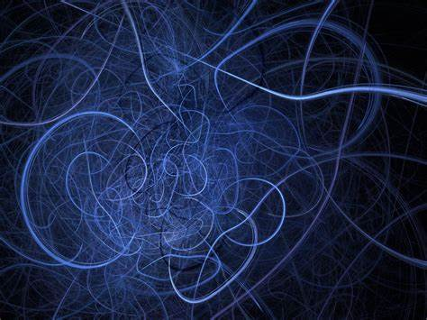

--- 
title: "দুই শব্দে কোয়ান্টাম মেকানিক্স"
author: "আব্দুল্যাহ আদিল মাহমুদ"
date: "2021-01-01"
site: bookdown::bookdown_site
output: bookdown::gitbook
documentclass: book
bibliography: [book.bib, packages.bib]
biblio-style: apalike
link-citations: yes
github-repo: mahmudstat/qm
description: "কোয়ান্টাম মেকানিক্সের সহজ পরিচয়"
---

# বই পরিচিতি {-}

(\#fig:cover)Quantum Mechanics: Symbolic Image

বর্তমান পদার্থবিদ্যা দাঁড়িয়ে আছে দুটো তত্ত্বের ওপর। একটি সার্বিক আপেক্ষিকতা। আরেকটি কোয়ান্টাম মেকানিক্স। সার্বিক আপেক্ষিকতার কাজ মহাবিশ্বের বড় জগৎ নিয়ে। গ্রহ, নক্ষত্র, ছায়াপথ আর ব্ল্যাক হোলদের নিয়ে। আর কোয়ান্টাম মেকানিক্সের কাজ পরমাণুর ছোট্ট গহীনে। কাজ করে অণু ও পরমাণূ নিয়ে। 

কোয়ান্টাম মেকানিক্সের কথাবার্তাগুলো খুবই অদ্ভুত। শুনলে মনে হবে সায়েন্স ফিকশন। কোয়ান্টাম মেকানিক্সের জ্ঞান আয়ত্ত্ব করা যার তার কম্ম নয়। নোবেলজয়ী পদার্থবিদ রিচার্ড ফাইনম্যান তো বলেই দিয়েছেন, "আমি নিশ্চিন্তে বলতে পারি, কোয়ান্টাম মেকানিক্স কেউ বোঝে না।" 

তত্ত্বটি বলে, পর্যবেক্ষণের আগে বস্তুর অস্তিত্ত্ব থাকে না। একই জিনিস হতে পারে তরঙ্গ কিংবা কণা। বহু দূরে থেকেও দুটি কণা ভূতুড়ে উপায়ে একে অপরের সাথে যোগাযোগ করতে পারে। ভোজবাজির মতো হঠাৎ করে শূন্য থেকে হাজির হয়ে যেতে পারে কণারা। করতে পারে সংরক্ষণশীলতা নীতিকে লঙ্ঘন। কণারা চলে যেতে পারে দেয়াল ভেদ করে। এমনই সব কাণ্ড ঘটায় কোয়ান্টাম মেকানিক্স। 

কোয়ান্টাম মেকানিক্স কথাটা দ্বারা আসলে কী বোঝায় দেখি। কোনো ক্রিয়া-প্রতিক্রিয়ায় অংশ নিতে সক্ষম ন্যূনতম ভৌত স্বত্ত্বার নাম কোয়ান্টাম। যেমন, ফোটন কণা হলো আলোর একটি কোয়ান্টাম। মেকানিক্স অর্থ বলবিদ্যা বা গতিবিদ্যা। তাই কোয়ান্টাম মেকানিক্স সবচেয়ে ছোট ছোট কণাগুলোর গতি ও আচরণ নিয়ে কাজ করে। বাংলায় বলা যায় কোয়ান্টাম বলবিদ্যা বা কোয়ান্টাম গতিবিদ্যা। আবার কোয়ান্টাম ফিজিক্স বা কোয়ান্টাম পদার্থবিদ্যা বলেও ডাকা হয়। আবার বলা হয় কোয়ান্টাম থিওরি বা তত্ত্ব বলেও। 

## লেখক পরিচিতি {-} 

**আব্দুল্যাহ আদিল মাহমুদ** 

(\#fig:translator)Translator

*পাবনা ক্যাডেট কলেজে* পরিসংখ্যান বিভাগের প্রভাষক হিসেবে কর্মরত। এর আগে রিসার্চ অ্যাসিস্ট্যান্ট হিসেবে কাজ করেছেন *ইঞ্জিনিয়ার্স অ্যান্ড অ্যাডভাইজরস লিমিটেড (EAL)* প্রতিষ্ঠানে।  ঢাকা বিশ্ববিদ্যালয়ের পরিসংখ্যান বিভাগ থেকে **অনার্স** ও **মাস্টার্স** ডিগ্রি অর্জন করেছেন। 

লেখালেখির সূচনা গণিত ম্যাগাজিন *পাই জিরো টু ইনফিনিটি*র মাধ্যমে। কন্ট্রিবিউটর হিসেবে কাজ করেছেন *প্রথম আলো* পরিবারের মাসিক বিজ্ঞান ম্যাগাজিন *বিজ্ঞানচিন্তা*য়। *কিশোরআলো*, *ব্যাপন*সহ বিভিন্ন ম্যাগাজিনে নিয়মিত লিখছেন গণিত, পরিসংখ্যান ও জ্যোতির্বিজ্ঞান নিয়ে। এছাড়া বিজ্ঞান বিষয়ে অনলাইনেও সক্রিয়ভাবে লেখালেখি করছেন। 

বাংলায় জ্যোতির্বিজ্ঞানকে জনপ্রিয়করণ ও সহজে উপস্থাপন করার জন্যে তৈরি করেছেন অনলাইন পোর্টাল [*বিশ্ব ডট কম*](https://sky.bishwo.com)।  একই উদ্দেশ্যে পরিসংখ্যান ও ডেটা সায়েন্স নিয়ে তৈরি করেছেন [*Stat Mania*](https://www.statmania.info)।

**প্রিয় শখ:** নতুন কিছু শেখা (বিশেষ করে গণিত ও জ্যোতির্বিজ্ঞান), প্রোগ্রামিং, ভ্রমণ ও রাতের আকাশ পর্যবেক্ষণ। 

**পৈত্রিক নিবাস:** লক্ষ্মীপুর সদর উপজেলার ঝাউডগী গ্রাম।

**লেখকের অনান্য বই**

- *[অ্যা ব্রিফার হিস্ট্রি অব টাইম](https://www.rokomari.com/book/author/47631)* (২০১৭) (অনুবাদ, মূল স্টিফেক হকিং ও লিওনার্দ ম্লোডিনো)
- *[মহাবিশ্বের সীমানা](https://www.rokomari.com/book/author/47631)* (২০১৯) 
- *[অসীম সমীকরণ](https://www.rokomari.com/book/author/47631)* (২০১৯) 
- *চন্দ্রজয়ের ৫০ বছর* (২০২০) (প্রথিতযশা কয়েকজন লেখকের সাথে যৌথভাবে) 

**ইমেইল:** almahmud.sbi@gmail.com

**ওয়েবসাইট:** [mahmud.bishwo.com](https://mahmud.bishwo.com)

**ফেসবুক:** [mahmud.sbi](https://fb.com/mahmud.sbi)

*ছবি:* সালমা সিদ্দিকা 

## লেখকের কথা {-} 

## বই কিনতে {-} 

বইটি এখনও অপ্রকাশিত। প্রকাশিত হলেই হার্ডকপি পাওয়া যাবে। [রকমারিসহ](https://www.rokomari.com/book/author/47631) বিভিন্ন অনলাইন সাইট থেকেও কেনা যাবে। 

# ভূমিকা {- #intro}
